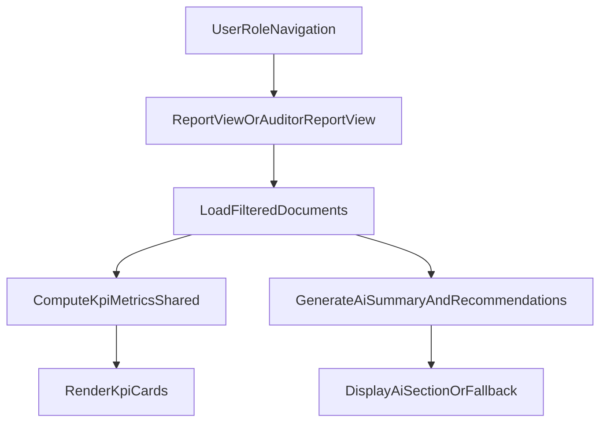

# Fix Report KPI Visibility Across Report Dashboards

## Goal
Make KPI cards render consistently on report pages for all roles and prevent KPI disappearance when AI-generated sections fail.

## Current Findings
- Manager/admin report page (`[C:/WorkAudit.CSharpOld/Views/ReportsView.xaml](C:/WorkAudit.CSharpOld/Views/ReportsView.xaml)`, `[C:/WorkAudit.CSharpOld/Views/ReportsView.xaml.cs](C:/WorkAudit.CSharpOld/Views/ReportsView.xaml.cs)`) builds KPI cards in code-behind via `PopulateKpiCards(...)`.
- Auditor/reviewer report page (`[C:/WorkAudit.CSharpOld/Views/AuditorReportsView.xaml](C:/WorkAudit.CSharpOld/Views/AuditorReportsView.xaml)`, `[C:/WorkAudit.CSharpOld/Views/AuditorReportsView.xaml.cs](C:/WorkAudit.CSharpOld/Views/AuditorReportsView.xaml.cs)`) currently has no KPI section.
- In `ReportsView.RefreshDashboard()`, KPI population currently happens after executive summary/recommendation generation in the same try path, so exceptions can suppress KPI rendering.

## Implementation Plan
1. **Decouple KPI rendering from AI/insight generation in manager report page**
   - Update `[C:/WorkAudit.CSharpOld/Views/ReportsView.xaml.cs](C:/WorkAudit.CSharpOld/Views/ReportsView.xaml.cs)` `RefreshDashboard()` so KPI rendering executes in its own protected path (separate `try/catch`, or early call before AI methods).
   - Ensure KPI cards are always populated when report data load succeeds, even if summary/recommendation calls fail.
   - Keep existing error messaging for AI sections, but do not clear/hide KPI area because of those failures.

2. **Add KPI section to auditor/reviewer report page**
   - Extend `[C:/WorkAudit.CSharpOld/Views/AuditorReportsView.xaml](C:/WorkAudit.CSharpOld/Views/AuditorReportsView.xaml)` with a KPI card container similar to manager report layout.
   - Implement corresponding card population in `[C:/WorkAudit.CSharpOld/Views/AuditorReportsView.xaml.cs](C:/WorkAudit.CSharpOld/Views/AuditorReportsView.xaml.cs)` (`PopulateKpiCards`/`AddKpiCard` style).
   - Reuse existing KPI formulas used in report view so both pages show aligned values for the same filters/date range.

3. **Reduce duplication by introducing shared KPI builder (targeted refactor)**
   - Add a small shared helper (new class under reports/view helper area) for KPI metric computation + card spec generation.
   - Use this helper from both `ReportsView` and `AuditorReportsView` code-behind to keep behavior consistent and avoid future drift.

4. **Validate role routing behavior and page load sequence**
   - Confirm report navigation in `[C:/WorkAudit.CSharpOld/MainWindow.xaml.cs](C:/WorkAudit.CSharpOld/MainWindow.xaml.cs)` still routes roles as intended.
   - Verify both views trigger KPI population on initial load and refresh actions.

5. **Verification checks**
   - Manager/admin: open report page with valid data; confirm KPI cards appear.
   - Auditor/reviewer: open report page; confirm KPI cards now appear.
   - Simulate AI summary/recommendation failure path; confirm KPI still visible while AI section shows graceful fallback message.
   - Run lint/diagnostics for touched files and resolve introduced issues.

## Data Flow After Fix

## Key Files
- `[C:/WorkAudit.CSharpOld/Views/ReportsView.xaml.cs](C:/WorkAudit.CSharpOld/Views/ReportsView.xaml.cs)`
- `[C:/WorkAudit.CSharpOld/Views/ReportsView.xaml](C:/WorkAudit.CSharpOld/Views/ReportsView.xaml)`
- `[C:/WorkAudit.CSharpOld/Views/AuditorReportsView.xaml.cs](C:/WorkAudit.CSharpOld/Views/AuditorReportsView.xaml.cs)`
- `[C:/WorkAudit.CSharpOld/Views/AuditorReportsView.xaml](C:/WorkAudit.CSharpOld/Views/AuditorReportsView.xaml)`
- `[C:/WorkAudit.CSharpOld/MainWindow.xaml.cs](C:/WorkAudit.CSharpOld/MainWindow.xaml.cs)`
- New shared KPI helper file (path to be chosen consistently with existing report/view helper organization).