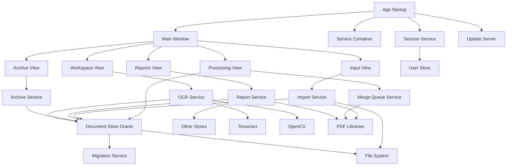
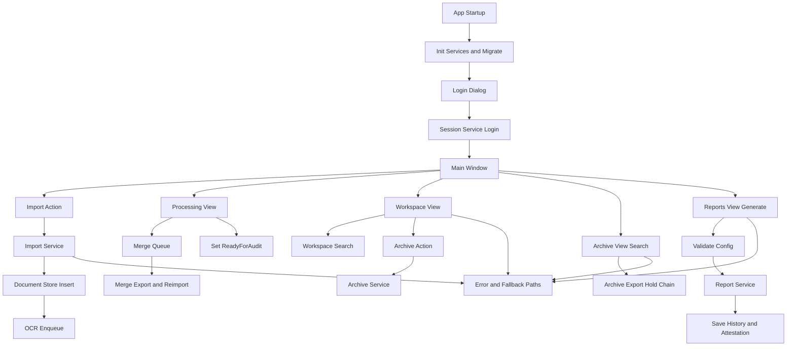
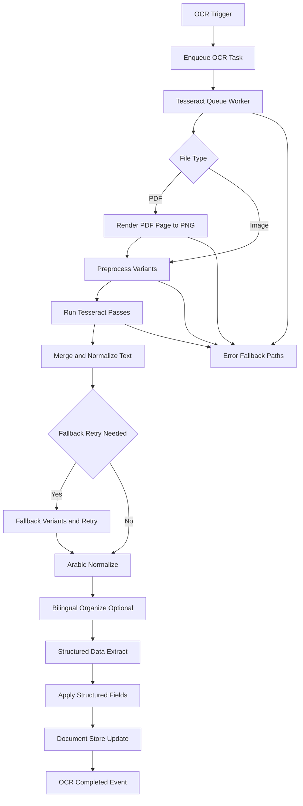
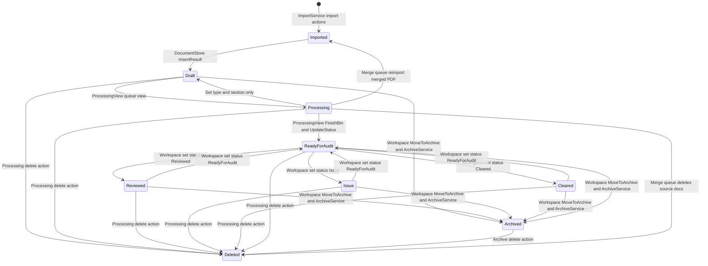

# WorkAudit Architecture and Workflow (Implementation-Based)

Implementation-based repo map completed from the runtime code paths in the desktop app, storage layer, and OCR pipeline.

## Component Summary

- **Entry/Bootstrap**
  - `App.xaml` + `App.xaml.cs` (`App_Startup`) initializes logging/theme, resolves base/data paths, calls `ServiceContainer.Initialize`, runs `IMigrationService.Migrate`, ensures admin user, then loops through `ShowLoginAndContinue`.
  - `Core/Services/ServiceContainer.cs` wires DI for UI-facing services, OCR, storage, compliance, reports, security, and scheduled jobs.

- **Authentication + Session**
  - `Dialogs/LoginDialog.xaml.cs` calls `ISessionService.LoginAsync`.
  - `Core/Security/SessionService.cs` handles lockout rules, emergency admin codes, session token creation, inactivity timeout, session invalidation.
  - `MainWindow.xaml.cs` inactivity timer calls `CheckInactivityTimeoutAsync`; logout triggers close/re-login loop in `App.xaml.cs`.

- **UI Layer (WPF)**
  - Shell: `MainWindow.xaml.cs` (`SwitchToView`) hosts role-based pages.
  - Input pipeline: `Views/InputView.xaml.cs` + `Views/ImportView.xaml.cs`.
  - Processing pipeline: `Views/ProcessingView.xaml.cs`.
  - Workspace operations: `Views/WorkspaceView.xaml.cs`.
  - Archive/search: `Views/ArchiveView.xaml.cs`.
  - Reporting: `Views/ReportsView.xaml.cs` + `Core/Reports/ReportService.cs`.
  - Admin windows under `Views/Admin/*`.
  - `Views/SearchView.xaml.cs` exists but has no runtime instantiation found (`new SearchView(...)` not found).

- **Import + Processing Services**
  - `Core/Import/ImportService.cs` imports image/PDF docs, inserts into `DocumentStore`, enqueues OCR as needed.
  - `Core/Services/ProcessingMergeQueueService.cs` serializes merge jobs, exports merged PDF, re-imports via `ImportSinglePdfDocumentAsync`, removes source docs/files.

- **OCR + Text Extraction**
  - `Core/TextExtraction/SelectingOcrService.cs` delegates to `TesseractOcrService`.
  - `Core/TextExtraction/TesseractOcrService.cs` does background queue OCR, multipass preprocessing, layout extraction, fallback retry, structured field extraction, then `IDocumentStore.Update`.
  - `Core/Helpers/DocumentWorkspaceOcr.cs` decides when to enqueue OCR from workspace/import status transitions.
  - Preview OCR overlay uses `IWindowsPreviewOcrLayout` bound to `TesseractPreviewOcrLayoutService`.

- **Data Layer (Oracle + file system)**
  - `Storage/DocumentStore.cs` is core query/update path (`ListDocuments`, `FullTextSearch`, `UpdateStatus`, `Update`, `Delete`, `GetStats`).
  - `Storage/MigrationService.cs` runs schema migrations (`Migration_001` ... `Migration_049`), includes FTS migrations.
  - Other stores: `UserStore`, `AuditLogStore`, `NotesStore`, `ConfigStore`, assignment/report stores, etc.
  - Files are stored in branch/section/type folders under configured base directory.

- **Compliance/Archive**
  - `Core/Compliance/ArchiveService.cs` sets archived status, retention expiry, immutability hash, and audit trail.
  - `ArchiveView` drives legal hold, custodians, disposal workflow, export, chain-of-custody.

- **External/Library Dependencies (runtime)**
  - OCR: `Tesseract`, `OpenCvSharp4`.
  - PDF/text/image: `PdfPig`, `PDFtoImage`, `PdfiumViewer.Net.WPF`, `PDFsharp`, `QuestPDF`.
  - Storage: `Oracle.ManagedDataAccess.Core` (Oracle provider).
  - UI/infra: `WebView2`, `OxyPlot`, `Serilog`, DI libs.
  - Update endpoint client: `AutoUpdateService` uses `HttpClient` to fetch `version.json` and zip packages.

## MAIN Architecture Diagram

## WORKFLOW Diagram (Detailed Runtime Path)

## OCR Pipeline Diagram (Focused)

## Document Lifecycle State Diagram

## Notes on unclear/unknown points

- `SearchView` has archive/search logic (including FTS path), but no direct instantiation/navigation path was found, so runtime usage is **unknown**.
- OCR engine selection wrapper exists (`SelectingOcrService`), but runtime wiring currently points to Tesseract path; alternative engine runtime switching is **unknown/not active** from current DI wiring.

## Recent Fixes (2026-04-21)

### Document Classification Workflow Hardening

Critical fixes were implemented to prevent document classification failures:

1. **Transaction Support** - Added transaction-aware methods to `DocumentStore` for atomic operations
2. **File Rollback Capability** - `FileRenameService` can now roll back file moves when database operations fail
3. **Fail-Fast Logic** - Processing stops immediately if either type or section update fails (prevents partial updates)
4. **Exponential Backoff Retry** - Improved from 4×75ms to 6 retries with backoff (50ms→1600ms) for Oracle lock/busy conditions
5. **Pre-flight Validation** - Checks file locks, disk space, and permissions before attempting operations
6. **Automatic Rollback** - Files are automatically moved back if database updates fail after file move
7. **Better Error Reporting** - Users see detailed failure reasons instead of silent failures

**Result:** Classification operations are now robust, consistent, and transparent. File system and database remain synchronized even during failures.

**Documentation:** See `docs/CLASSIFICATION_WORKFLOW_FIX.md` and `docs/CLASSIFICATION_FIX_SUMMARY.md` for complete details.
